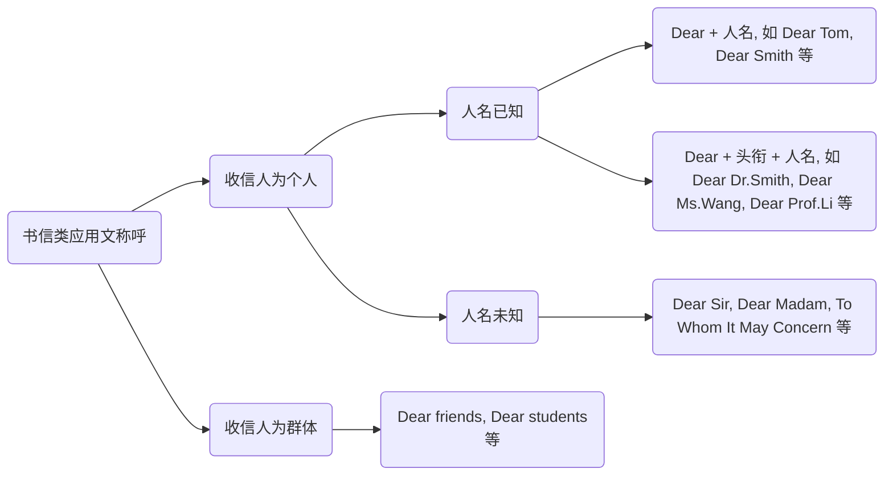

## 议论文

### 科技正让人变得懒惰吗？

#### Title

*For this part, you are allowed 30 minutes to write an essay titled "**Is technology making people lazy?**".*

*Many studies claim that computers distract people, make them lazy thinkers and even lower their work efficiency.*

> 在这部分，你有30分钟的时间写一篇题为“科技让人懒惰吗？”的文章。
> 
> 许多研究声称，电脑分散了人们的注意力，使他们成为懒惰的思考者，甚至降低了他们的工作效率。

#### 范文

&emsp;&emsp;① Nowadays, technology plays an increasingly significant role in people's life and brings people lots of convenience. For this trend, some people argue that technology is making people lazy and lowering our work efficiency. ② But in my opinion, technology actually makes people more diligent rather than lazy.

> 开头段：① 引出话题；② 提出观点。
>
> ① 如今，技术在人们的生活中发挥着越来越重要的作用，给人们带来了很多便利。对于这一趋势，一些人认为技术让人们变得懒惰，降低了我们的工作效率。
> ② 但在我看来，技术实际上让人们更加勤奋，而不是懒惰。

&emsp;&emsp;③ First of all, the development of technology itself is a product of diligence, because it requires people's continuous and long-term efforts to study. ④ Moreover, the progress of technology liberates ourselves from heavy physical labour to save us much time that can be spent on more meaningful things. For example, thanks to the development of the Internet, we can study online without going to school. ⑤ Last but not least, technology can act as an inspiration for people to improve their abilities, as it gives people a sense of crisis that they may be falling behind the times. People are willing to take effort to engage in innovative and creative work for fear of being replaced by technological inventions.

> 主旨段：给出论据论证论点
>
> ③ 首先，技术的发展本身就是勤奋的产物，因为它需要人们持续和长期的努力来学习。（论据一）
> ④ 此外，技术的进步将我们从繁重的体力劳动中解放出来，为我们节省了很多时间，这些时间可以花在更有意义的事情上。例如，由于互联网的发展，我们可以在不上学的情况下在线学习。（论据二）
> ⑤ 最后但同样重要的是，技术可以激励人们提高自己的能力，因为它给人们一种可能落后于时代的危机感。人们愿意努力从事创新和创造性的工作，因为害怕被技术发明所取代。（论据三）

&emsp;&emsp;⑥ In conclusion, it is a radical view that technology will make people lazy. The reason for laziness can only be found from people themselves. ⑦ We had better work hard with technology, than criticize it.

> 结尾段：⑥ 总结全文；⑦ 提出建议。
>
> ⑥ 总之，技术会让人懒惰，这是一种激进的观点。懒惰的原因只能从人们自己身上找到。
> ⑦ 与其批评技术，我们还不如努力工作。

### 网络暴力视频游戏是否会导致学生的暴力行为

#### Title

*For this part, you are allowed 30 minutes to write an essay on whether violent video games online will cause students’ violent behaviors.*

> 假设你们的大学学生会计划举办一场演讲比赛。你现在要写一份组织比赛的建议。提案可能包括主题、目的、程序和参赛者的选择。

#### 范文

&emsp;&emsp;① With the popularization of the Internet and smartphones, it is much easier for kids today to get access to video games, many of which contain violent elements. ② Despite the fact that they help kids relieve anxiety and stress, violent video games will lead to kids' violent behavior to some extent.

> 开头段：① 描述现状，引出话题；② 提出观点，表明态度。
>
> ① 随着互联网和智能手机的普及，如今的孩子们更容易接触到电子游戏，其中许多游戏都包含暴力元素。
> ② 尽管暴力电子游戏可以帮助孩子缓解焦虑和压力，但在一定程度上会导致孩子的暴力行为。

&emsp;&emsp;③ Firstly, violent elements in these video games may mislead kids into considering violence reasonable, thus making them more prone to solve problems violently. ④ Secondly, when they experience frequent failures in the games, the feeling of frustration might develop their bad temper, encouraging their impulsive and reckless behavior in real life. ⑤ in addition, in their adolescence when most of kids haven't formed their proper perception of the world, virtual violent scenes may put them into a psychological state of disregarding life, which is quite worrisome.

> 主旨段：③ 针对论点给出第一个论据，并解释、支撑该论据；④ 针对论点给出第二个论据，并解释、支撑该论据；⑤ 针对论点给出第三个论据，并解释、支撑该论据
>
> ③ 首先，这些电子游戏中的暴力元素可能会误导孩子们认为暴力是合理的，从而使他们更容易暴力解决问题。（论据一）
> ④ 其次，当他们在游戏中频繁失败时，挫败感可能会发展他们的坏脾气，鼓励他们在现实生活中冲动和鲁莽的行为。（论据二）
> ⑤ 此外，在青少年时期，当大多数孩子还没有形成对世界的正确认知时，虚拟暴力场景可能会使他们陷入漠视生命的心理状态，这令人担忧。（论据三）

&emsp;&emsp;⑥ As far as I can see, parents and teachers should pay more attention to kids' mental health and spiritual well-being, so that they can establish their own judgment and not be affected by the harmful factors in the violent video games.

> 结尾段：⑥ 总结全文；可发表意见、给出建议、指明方向、言明后果或号召读者等
>
> ⑥ 在我看来，家长和老师应该更多地关注孩子的心理健康和精神健康，这样他们才能建立自己的判断，而不会受到暴力电子游戏中有害因素的影响。（总结全文，给出建议）

## 应用文

### 报道类应用文

#### Title

*For this part,you are allowed 30 minutes to write a short essay about a campus activity that has benefited you most.*

> 在这部分中，你有30分钟的时间写一篇关于对你最有益的校园活动的短文。

#### 范文

&emsp;&emsp;① A project of collecting used books was launched by the student union of our university on the playground from last Wednesday to Friday, which has aroused extensive attention on campus.

> 开头段（导语）：概括活动的主要内容，可点明时间、地点、组织者等信息
>
> 事件内容：A project of collecting used books was launched
> 组织者：the student union of our university
> 地点：on the playground
> 时间：from last Wednesday to Friday
> ① 上周三至周五，我校学生会在操场上发起了一项收集旧书的项目，引起了校园的广泛关注。

&emsp;&emsp;② The project is aimed at attracting students' attention to second-hand books and inspiring them to make the best of used books. ③ Nearly 200 students andteachers played an active part in the project. ④ The main activity ofthe proiect was the donation of used books.It means that participants could donate books they don't need any more, after which they could get gifts such as pens and notebooks. After the three-day collection, the student union received more than 300 used books, which were sorted according to different subjects. Given that the number of the used books collected was quite large, the student union decided to distribute some of them to students in need, and put the rest in the library so that everyone could borrow them.

> 主旨段（主体）：根据题目给出的写作指令，介绍活动的目的、参与者及其活动内容等。② 活动目的；③ 参与者；④ 活动内容
>
> ② 该项目旨在吸引学生对二手书的关注，并激励他们充分利用二手书。
> ③ 近200名学生和教师积极参与了该项目。
> ④ 该活动的主要活动是捐赠旧书。这意味着参与者可以捐赠他们不再需要的书籍，之后他们可以得到钢笔和笔记本等礼物。经过三天的收集，学生会收到了300多本二手书，这些书是根据不同的科目分类的。鉴于收集的旧书数量相当多，学生会决定将其中一部分分发给有需要的学生，其余的放在图书馆，以便每个人都能借阅。

&emsp;&emsp;⑤ In conclusion, the project not only makes full use of the second-hand books, but is conducive to resource conservation and environmental protection. Therefore, it is worthwhile and meaningful to organize more such projects in the future.

> 结尾段（结语）：总结全文，升华主题。
>
> ⑤ 总之，该项目不仅充分利用了二手图书，而且有利于节约资源和保护环境。因此，在未来组织更多这样的项目是值得和有意义的。

### 书信类应用文

书信类作文一般包含四要素：称呼、正文、落款、签名。

1）称呼：即写信人对收信人的称谓，位于书信开头，左顶格，英文书信称呼后一般用逗号。

2）正文是一封书信的主体部分，也是最重要的部分，其内容需涵盖题目中所规定的内容要点，一般采用三段式布局。以“给想学汉语的外国朋友推荐一个地方”这一话题写一封书信为例：

&emsp;&emsp;① How is everything going with you? I recently saw on Facebook that you had decided to come to China to learn Chinese, and I'm writing to strongly recommend Shanghai to you.

> 开头段：礼貌问候，表明目的。
>
> ① 你过得怎么样？我最近在 Facebook 上看到你决定来中国学习中文，我写信向你强烈推荐上海。

&emsp;&emsp;② First of all, as an important economic, financial and trading center of China, Shanghai is a city where over 100 institutions specializing in language teaching and training have emerged, and most of the Chinese teachers have cross-cultural communication skills. Therefore, teaching quality can be guaranteed. ③ Secondly, Shanghai is listed as one of the happiest cities in China. Its open policy has attracted people from all over the world to work, study and live here, which also benefits Chinese learning for foreigners. ④ In addition, if you want a very pleasant learning environment and flexible learning time, Shanghai is a good choice. You can practice your Chinese speaking and listening skills with millions of Chinese people here, and oxchange your experience in learning Chinese. they will al be you language partners.

> 主旨段：根据书信的类型及其写作目的添加具体信息。
>
> ② 首先，作为中国重要的经济、金融和贸易中心，上海已经出现了100多家专门从事语言教学和培训的机构，大多数汉语教师都具有跨文化沟通能力。因此，教学质量是可以保证的。（推荐理由一）
> ③ 其次，上海被列为中国最幸福的城市之一。它的开放政策吸引了来自世界各地的人们来这里工作、学习和生活，这也有利于外国人学习汉语。（推荐理由二）
> ④ 此外，如果你想要一个非常愉快的学习环境和灵活的学习时间，上海是一个不错的选择。你可以在这里与数以百万计的中国人一起练习你的汉语口语和听力，并改变你学习汉语的经验。他们将是你们的语言伙伴。（推荐理由三）

&emsp;&emsp;⑤ I would be glad if you could accept my recommendation. Let me know if you have any questions or concerns.

> 结尾段：总结全文，表达期望。
>
> ⑤ 如果你能接受我的推荐，我将非常高兴。如果您有任何问题或顾虑，请告诉我。

3）落款：一般根据收信人和写信人关系的友好和亲密程度确定。常见的有以下几种：

- Yours sincerely 或 Sincerely yours 可用于各种情况；
- Yours very truly 或 Very truly yours 常用于与收信人不太熟悉需要客气的情况；
- Yours respectfully 或 Respectfully yours 常用于与收信人不太熟悉而需要客气的情况；
- Yours faithfully 或 Faithfully yours 常用于以 "Dear Sir/Madam" 开头的正式邮件中；
- Lovingly yours 或 Yours 常用于与收信人关系较为亲密的情况。

4）签名：书信类应用文的最后一部分（考试中切忌落款写真实姓名），位于结尾处落款下方一至两行，与结尾处落款左起对齐。

> 注意：
>
> 英文信件不同于中文信件，签名下面不需要写日期，且应用文写作题目指令中未要求写日期，故考试时也不必补充日期。

### 计划类应用文

主要分为三部分：前言、主题和结尾。分别对应三段式布局的开头段、主旨段和结尾段，通常按照“为什么做”、“做什么以及怎么做”、“总结全文”的思路展开。以“新生入学培训”这一主题写一份计划书为例：

&emsp;&emsp;① Freshmen's college life is just around the corner, and those freshers wil be in a transitional phase which is exciting as well as disturbing. ② In order to help the freshmen adapt to the new environment and academic study, our school is planning to organize an orientation program. ③ This is a proposal for the program, and the main points are as follows.

> 开头段（前言）：① 简述背景信息、基本情况或指导思想；② 说明目的或一句，写清“为什么做”；③ 用过渡语引出主体部分。
>
> ① 大一新生的大学生活指日可待，他们将处于一个令人兴奋和不安的过渡阶段。（背景信息）
> ② 为了帮助新生适应新的环境和学术学习，我们学校正计划组织一个迎新计划。（目的）
> ③ 这是该计划的一个建议，其要点如下。

&emsp;&emsp;④ The orientation program held by the student union will last a week, from Sep. 10th to 16th. ⑤ All the new students are required to attend and assemble in front of the library at 8:00 a.m. every day. For the exact procedure, firstly, a brief introduction that includes the information of our school and academic study will be given to the newcomers, which can help them learn more about the new school where they will stay for several years. Secondly, we will organize activities covering different topics including knowledge as well as entertainment for students to choose. Finally, members of the student union will lead the newcomers to visit our campus.

> 主旨段（主体）：④ 明确时间；⑤ 明确计划的步骤、实施措施、方法等，使人明白“做什么以及怎么做”。
>
> ④ 学生会将于 9 月 10 日至 16 日举办为期一周的迎新活动。（时间）
> ⑤ 所有的新生都被要求每天早上 8 点到图书馆前集合。关于确切的程序，首先，将向新来的学生简要介绍我们学校和学术学习的信息，这可以帮助他们更多地了解他们将在那里待几年的新学校。其次，我们将组织涵盖不同主题的活动，包括知识和娱乐，供学生选择。最后，学生会成员将带领新来的学生参观我们的校园。（步骤）

&emsp;&emsp;⑥ I believe this orientation program will be held successfully and end in a satisfactory way, making freshmen feel at home in the new environment.

> 结尾段（结尾）：根据内容确定，可表达对计划成功实施的期望，也可强调计划执行的要求等。
>
> ⑥ 我相信这次迎新活动一定会圆满举行，圆满结束，让新生在新的环境中有宾至如归的感觉。（期望）

#### 举办演讲比赛

##### Title

*Suppose your university student union is planning to hold a speech contest. You are now to write a proposal for organizing the contest. The proposal may include the topic, aim, procedure and selection of contestants.*

> 假设你们的大学学生会计划举办一场演讲比赛。你现在要写一份组织比赛的建议。提案可能包括主题、目的、程序和参赛者的选择。

##### 范文

&emsp;&emsp;① Hearing about the plan of our student union to hold a speech contest, I would like to write a proposal for it. The specific contents are as follows.

> 开头段：介绍背景及写作目的
>
> ① 听说我们学生会计划举办演讲比赛，我想写一份提案，具体内容如下。

&emsp;&emsp;② With the purpose of enriching students' extracurricular activities and motivating students to make preparations for their future, the speech contest titled "Opportunities are Only for the Prepared Minds" is proposed to be held. ③ The speech contest will be scheduled for next Wednesday,lasting from 7 p.m. to 9 p.m. at the School's International Hall. ④ Students who are interested in the contest will be organised to register with their monitor before 6 p.m. on this Friday, and a self-introduction video will be required. Afterwards, from those who submit the videos, 30 excellent contestants will be selected by the student union to participate in the preliminary contest a three-minute impromptu speech competition, among which only 10 competitors will reach the final. Besides, several well-known professors will be invited as judges to give professional comments at the end of each speech. Ultimately, the top three will be rewarded.

> 主旨段：阐述细节
>
> ② 为了丰富学生的课外活动，激励学生为自己的未来做好准备，拟举办题为“机会只给有准备的人”的演讲比赛。（比赛目的及主题）
> ③ 演讲比赛定于下周三下午 7 点至 9 点在学校国际大厅举行。（比赛举办时间及地点）
> ④ 对比赛感兴趣的学生将被组织在本周五下午6点前向班长登记，并需要一段自我介绍视频。随后，学生会将从提交视频的学生中选出30名优秀选手参加初赛，这是一场三分钟的即兴演讲比赛，其中只有10名选手将进入决赛。此外，还将邀请几位知名教授担任评委，在每次演讲结束时发表专业意见。最终，前三名将获得奖励。（参赛选手的选拔及比赛流程）

&emsp;&emsp;⑤ I hope this contest will be successfully held, helping students build up their awareness of planning as well as improve their eloquence and confidence.

> 结尾段：表达期望
>
> ⑤ 我希望这次比赛能够成功举办，帮助学生们树立计划意识，提高他们的口才和信心。

### 其他应用文

#### 告示类应用文

告示类应用文一般包括启事、通知、公告等，写法虽各有不同，但也有相对统一的格式和要求。一般需要包含以下几个要素：

1. 标题，如征稿启事 [Contributions Wanted]、招领启事 [Found]、开会通知 [Notice of Meeting] 等；
2. 日期（视情况确定是否需要标注）；
3. 正文（根据需要写 1-3 段，具体阐述时间、起因、经过、目的、结果等）；
4. 公告单位或者个人署名。

以下为告示类应用文写作的常用格式：

Notice of Meeting

June 16th, 2022

&emsp;&emsp;<u>                                                                                                                                                                                                                                                                                                                                       正文                                                                                                                                                                              _</u>

Student Union

#### 便条

便条是一种简单的书信，虽然内容简单，却有其独特的风格。其主要目的是把信息简明扼要地告知对方。常见的便条有留言条和请假条等形式。一般需要包含以下要素：

1. 日期，即写便条的日期。英文便条日期一般写在便条的右上角，偶尔也见写在便条的左上角；
2. 称呼，一般以 Dear 开头，顶格写在日期下一至两行；
3. 正文，是便条的主要组成部分，主要为书写人要叙述或谈论的事情。便条的内容简单、字数少，因此，正文一般只需写一段即可；
4. 结尾落款，一般用 Yours sincerely 或 Sincerely yours 即可；
5. 签名，写在正文的右下角，与落款左端对齐。

以下为便条类应用文写作的常用格式：

June 16th, 2022

Dear <u>            _,</u>
&emsp;&emsp;<u>                                                                                                                                                                                                                                                                                                                                       正文                                                                                                                                                                              _</u>

Yours sincerely,

Li Ming &emsp;&emsp;&emsp;&ensp;

#### 演讲稿

演讲稿一般需要包含以下要素：

1. 称呼语，即对听众的称谓，顶格写，一般用泛称，如 Ladies and gentlemen；
2. 正文，包括开场白，主体和结尾。开场白需开门见山地提出演讲的主题，说明演讲的意图；主体需细化、深化并强调演讲的中心思想；结尾要总结全文。

以下为演讲稿写作的常用格式：

Ladies and gentlemen,
&emsp;&emsp;<u>                                                                                                                                                                                                                                                                                                                                       正文                                                                                                                                                                              _</u>